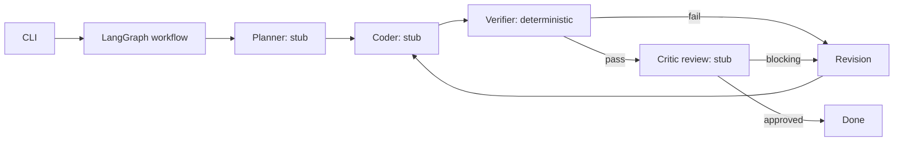

# HIALT CLI

HIALT is an orchestration framework for autonomous software-engineering workflows. The LangGraph workflow owns coordination; LLM providers are replaceable reasoning engines; deterministic tools provide evidence; and the execution trace records how a run proceeded.

## Vision

HIALT is not a coding assistant wrapper. Its long-term role is to orchestrate planning, coding, verification, critique, Git, filesystem work, and execution history across heterogeneous capabilities. The current repository establishes those boundaries; planner, coder, and provider-backed critic behavior are still stubs.

## Core architecture



The graph emits immutable `TraceEntry` records and uses provider and tool boundaries documented in [Architecture](docs/ARCHITECTURE.md).

## Current workflow

1. The planner creates a placeholder `ExecutionPlan`.
2. The coder creates placeholder code.
3. The verifier runs pytest, Ruff, and MyPy through `ToolRunner`.
4. On successful verification, the critic currently returns no issues because its provider call is not wired.
5. Blocking feedback or failed verification revises until the configured iteration limit; otherwise the run is approved.

## Installation and usage

Requires Python 3.11+ and [uv](https://docs.astral.sh/uv/).

```bash
uv sync
uv run hialt run --task "Describe a small command-line tool"
```

## Tests and quality checks

```bash
uv run pytest
uv run ruff check .
uv run mypy src
```

## Logging

CLI startup configures a Rich-backed root logger from `Settings.log_level`, which defaults to `INFO` and can be overridden by `HIALT_LOG_LEVEL`. Logging records application behavior; `ExecutionTrace` records workflow facts. See [Logging](docs/LOGGING.md).

## Repository layout

```text
src/hialt/
  agents/       Workflow roles and LangGraph composition
  providers/    Provider protocol and vendor adapters
  tools/        Deterministic subprocess boundary
  execution_trace.py  Immutable workflow journal models
  settings.py   Runtime configuration
tests/          Unit and integration-oriented workflow tests
docs/           Architectural reference
```

## Documentation

- [Architecture](docs/ARCHITECTURE.md)
- [Providers](docs/PROVIDERS.md)
- [Execution Trace](docs/EXECUTION_TRACE.md)
- [Logging](docs/LOGGING.md)
- [Roadmap](docs/ROADMAP.md)
- [Contributing](docs/CONTRIBUTING.md)

## Development and future direction

Read the relevant source and tests before changing a boundary, keep providers interchangeable, and document stubs honestly. Next work includes prompt rendering, wiring providers into planner/coder/critic, role-level multi-provider configuration, Git tooling, and observability improvements. See [Roadmap](docs/ROADMAP.md).
