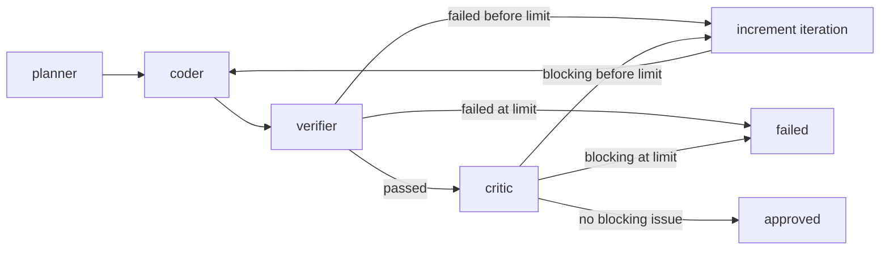

# Architecture

## System purpose

HIALT owns workflow orchestration. LangGraph coordinates capabilities, providers supply reasoning, deterministic tools provide verification, and `ExecutionTrace` preserves workflow history. This separation avoids making graph policy depend on a provider or tool implementation.

## Workflow

`build_graph()` compiles this state machine with LangGraph `MemorySaver`. Each node appends trace entries and updates `AgentState`. Planner and coder are stubs; verifier is real deterministic execution; critic response parsing exists but `review()` does not call a provider yet.

## State and roles

`AgentState` carries the task, plan, current code, critic feedback, verification result, iteration, status, and append-only `execution_trace`. `ExecutionPlan`, `CriticIssue`, `ToolResult`, and `VerificationResult` are typed artifacts that keep role handoffs explicit.

| Role | Responsibility today |
| --- | --- |
| Planner | Stub that returns a placeholder plan. |
| Coder | Stub that returns placeholder code and accepts feedback for the future revision loop. |
| Verifier | Runs pytest, Ruff, and MyPy through `ToolRunner`; no LLM judgment. |
| Critic | `review()` is a stub; `_parse_response()` repairs and validates model-shaped issue lists. |

## Providers and dependencies

`Provider` is the graph-independent capability protocol. `GraphDependencies.from_settings()` explicitly assembles role providers, runner, and policy, then `build_graph()` binds them into nodes. Node functions also retain an implicit fallback that calls `get_settings()` and builds a provider when invoked directly.

That coexistence is an open tradeoff, not settled architecture. Explicit injection makes graph composition, testing, and role configuration visible. The fallback keeps individual node calls convenient but hides configuration behind a cached global singleton. Future work should decide whether to remove the fallback or make its lifecycle/configuration more explicit.

`settings.py` currently reads log level, iteration limit, tool timeout, retry count, and approval severity from environment variables. Role provider/model settings are structured but only provider/model selection supported by the current factory is `stub`/`local`, Ollama, or Anthropic.

## Tools, trace, and logging

`ToolRunner` is the sole subprocess boundary and returns `ToolResult` instead of raising expected command failures. It has focused pytest/Ruff/MyPy conveniences plus generic `run()` for future adapters.

`ExecutionTrace` is an immutable workflow journal, not logging. It complements centralized Rich logging, which reports software operation. See [Execution Trace](EXECUTION_TRACE.md) and [Logging](LOGGING.md).

## Related documents

- [Providers](PROVIDERS.md)
- [Roadmap](ROADMAP.md)
- [Contributing](CONTRIBUTING.md)
